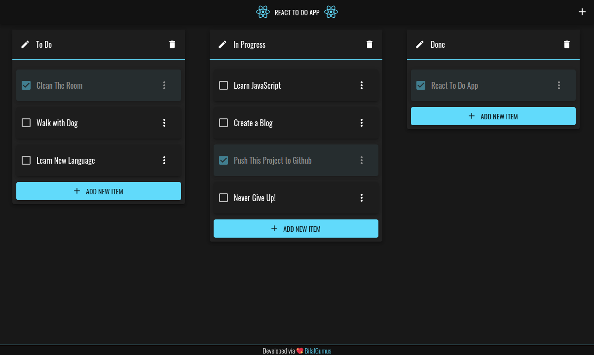

# React To Do App

Hi 👋, This is a simple to do app which is created with [ReactJS](https://reactjs.org/).

## Project

🟢 You can check the demo at here: https://react-to-do-app.bilalgumus.co



> Screenshot from the project

### Instructions

This project was bootstrapped with [Create React App](https://github.com/facebook/create-react-app).

#### View On Local

First clone this repository.
```bash
$ git clone https://github.com/BilalGumus/react-to-do-app.git
```

In the project directory, you can run: (Make sure you already have [`nodejs`](https://nodejs.org/en/) & [`npm`](https://www.npmjs.com/) installed in your system.)

```bash
npm install && npm start
```

Runs the app in the development mode.

Open [http://localhost:3000](http://localhost:3000) to view it in the browser.
